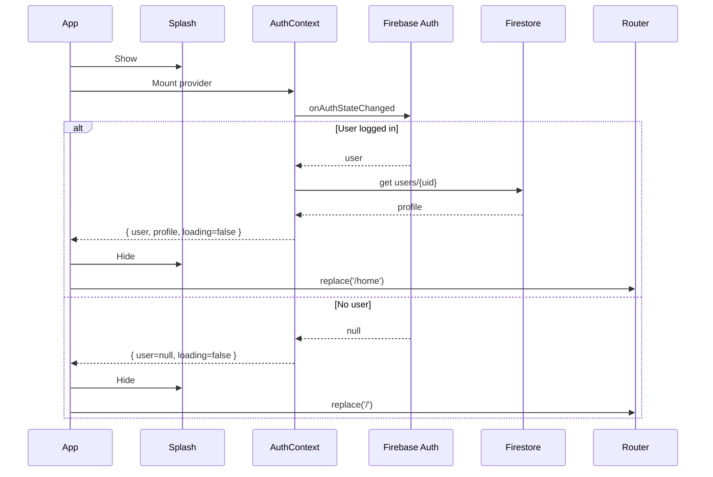

# Architecture Overview

This document summarizes the high-level architecture of the Campus Lost & Found mobile app built with Expo + React Native.

## 1) High-Level System
- Client: Expo React Native app using file-based routing (expo-router)
- Backend Services: Firebase Authentication and Firestore
- Platform: iOS, Android, and Web (via React Native Web)

````
+-------------------------+         +--------------------------+
|     React Native App    |<------->|  Firebase Authentication |
| (Expo, expo-router, RN) |   Auth  +--------------------------+
|                         |         +--------------------------+
|  UI Screens (Tabs/Stack)|<------->|       Firestore (DB)     |
|  Context (AuthContext)  |  Data   +--------------------------+
|  Hooks / SDKs (Expo)    |
+-------------------------+
```

## 1a) Architecture Diagram (Mermaid)

```mermaid
flowchart LR
  subgraph Client[React Native App (Expo)]
    UI[UI Screens (Tabs/Stack)]
    Ctx[AuthContext]
    SDK[Expo SDKs]
  end

  subgraph Firebase[Firebase]
    Auth[Authentication]
    DB[(Firestore)]
  end

  UI -->|Navigation & Actions| Ctx
  Ctx <--> |Auth State| Auth
  Ctx <--> |Profile Read/Write| DB
  UI <--> |Data Fetch/Mutate| DB
```

## 2) Core Technologies
- React Native + Expo SDK
- expo-router (Stack + Tabs)
- Firebase (Auth + Firestore)
- Expo SDK modules: AuthSession (Google), WebBrowser, Image Picker, Maps (planned/used), etc.

## 3) App Structure (selected)
- `app/_layout.tsx`: App entry for navigation. Wraps in `AuthProvider`, hides SplashScreen after auth is ready, and redirects to `/home` (tabs) when logged in or `/` otherwise.
- `app/index.tsx`: Landing page (Login / Register CTAs).
- `app/(auth)/*`: Auth stack (login, register) via `app/(auth)/_layout.tsx`.
- `app/(tabs)/_layout.tsx`: Main tab navigator: `home`, `map`, `chat`, `projects`, `marketplace`, `profile`.
- `contexts/AuthContext.tsx`: Listens to Firebase Auth state changes, loads user profile from Firestore, and exposes `{ user, userProfile, loading }`.
- `firbase.config.ts`: Initializes Firebase `app`, `auth`, and `db` (Firestore).

## 4) Authentication Flow
1. SplashScreen shown while auth state is resolving.
2. `AuthContext` subscribes to `onAuthStateChanged(auth)`.
3. If `user` exists, fetch `users/{uid}` from Firestore as profile, then set `loading=false`.
4. Root layout hides SplashScreen and redirects based on `user` presence.
5. Sign-in options:
   - Email + password (`signInWithEmailAndPassword`)
   - Google Sign-In via `expo-auth-session` → get `id_token` → `signInWithCredential` (Firebase)

Sequence (simplified):
```
App Start → Splash → AuthContext (subscribe) → Firestore profile fetch (if user)
    └─ user? yes → router.replace('/home')
                no  → router.replace('/')
```

### 4a) Auth Flow Sequence (Mermaid)



## 5) Routing Topology (expo-router)
- Stack (root): `index`, `(auth)`, `(tabs)`
- `(auth)` Stack: `login`, `register`
- `(tabs)` Tabs: `home`, `map`, `chat`, `projects`, `marketplace`, `profile`

```
app/
  _layout.tsx        # Root stack and redirects
  index.tsx          # Landing
  (auth)/            # Auth area
    _layout.tsx
    sign-in.tsx
    sign-up.tsx (planned/register)
  (tabs)/            # Main app area
    _layout.tsx
    home.tsx
    map.tsx
    chat.tsx
    projects.tsx
    marketplace.tsx
    profile.tsx
```

## 6) Data Model (current & extendable)
- Collection: `users/{uid}`
  - Fields: `email`, `username`, `phoneNumber`, ...
- Future collections (examples):
  - `lostItems/{itemId}`: title, description, ownerUid, location, imageUrl, createdAt
  - `marketplaceListings/{listingId}`: title, price, ownerUid, images[], status
  - `chats/{threadId}/messages/{messageId}`: senderUid, text, createdAt

## 7) Security & Permissions (guidance)
- Firebase Auth required for protected routes and write operations.
- Firestore Security Rules (example approach):
  - Allow users to read/write their own profile `users/{uid} if request.auth.uid == uid`.
  - Limit writes to listings owned by the authenticated user.
  - Validate field types and sizes; use server timestamps.

## 8) UI/UX Principles
- Splash-to-auth resolution prevents flicker and incorrect initial route.
- Tabs for quick access to core features (Home/Map/Chat/Projects/Marketplace/Profile).
- Reusable context for auth state reduces prop drilling.

## 9) Build & Run
- Install: `npm install`
- Start: `npx expo start`
- Run on iOS/Android simulators or Expo Go.
- Configure Google OAuth Client ID and Firebase keys via environment variables for production.

## 10) Future Enhancements
- Move secrets to env (e.g., `app.config.ts` with `EXPO_PUBLIC_*` vars).
- Implement create/read flows for Lost Items and Marketplace listings.
- Add Firestore Rules and CI checks.
- Add error boundaries, toasts, and basic analytics.
- Consider RTK Query or React Query if data interactions grow.
